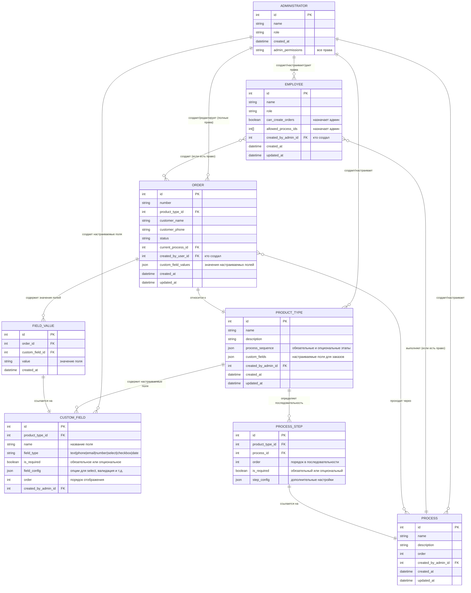
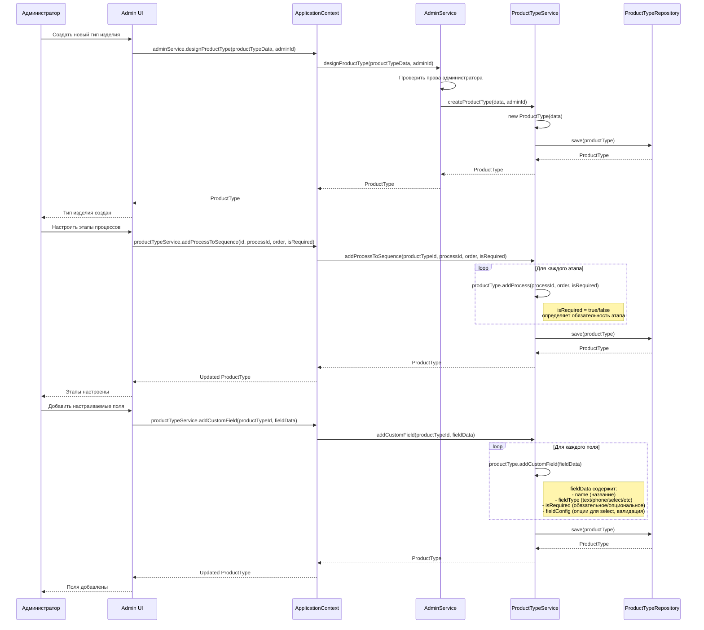
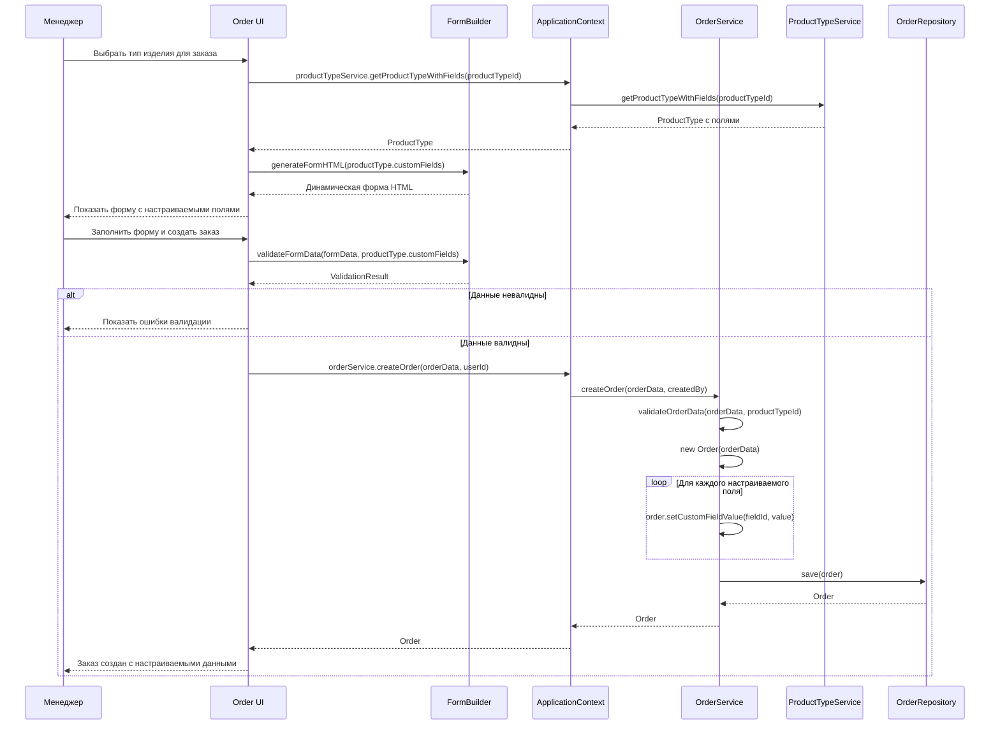
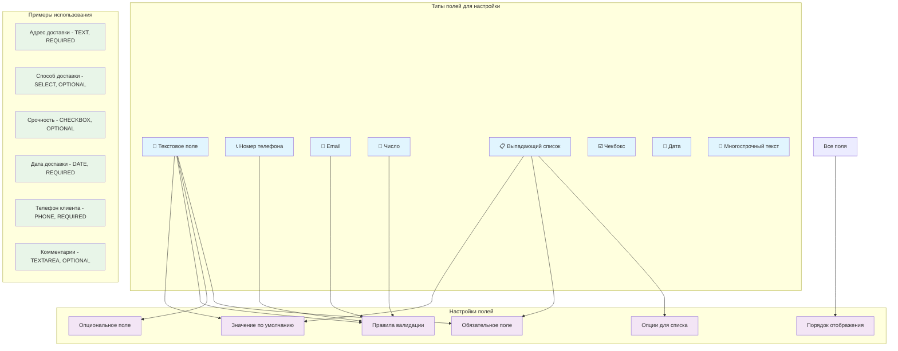
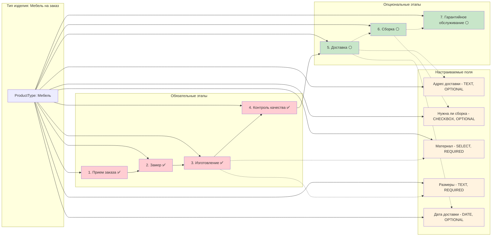
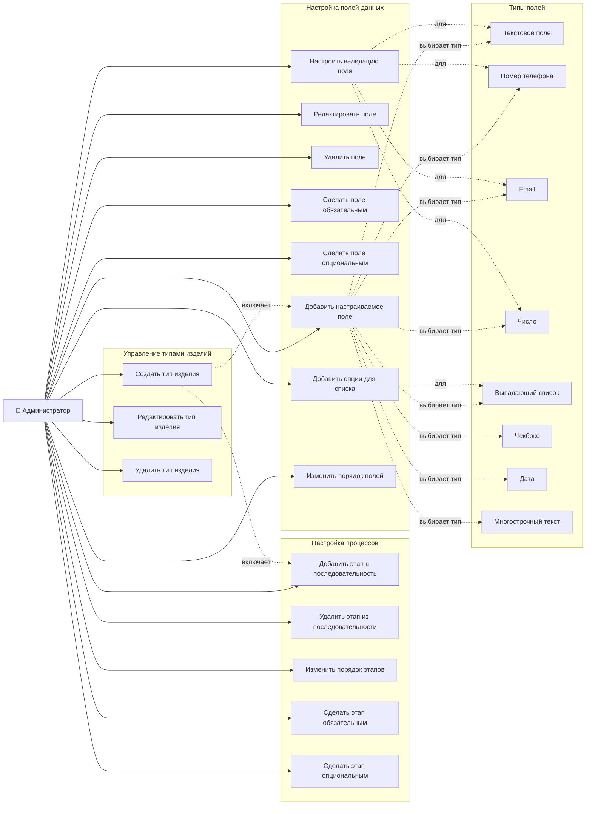

# OMS - UML диаграммы системы

## Обновленная ER-диаграмма с настраиваемыми типами изделий

## Диаграмма классов с настраиваемыми типами изделий

```mermaid
classDiagram
    class Entity {
        <<abstract>>
        -int _id
        -Date _createdAt
        -Date _updatedAt
        -int _createdBy
        +getId() int
        +touch() void
        +toJSON() object
        #generateId() int
    }
    
    class User {
        -string _name
        -string _role
        -UserPermissions _permissions
        -int _createdBy
        +isAdmin() boolean
        +canCreateOrders() boolean
        +canPerformProcess(processId) boolean
        +canManageUsers() boolean
        +canManageSystem() boolean
    }
    
    class UserPermissions {
        -boolean _canCreateOrders
        -int[] _allowedProcessIds
        +addProcessRight(processId) void
        +removeProcessRight(processId) void
        +setOrderCreationRight(canCreate) void
    }
    
    class Process {
        -string _name
        -string _description
        -int _order
        +setName(name) void
        +setDescription(description) void
        +setOrder(order) void
    }
    
    class ProcessStep {
        -int _processId
        -int _order
        -boolean _isRequired
        -object _stepConfig
        +setRequired(required) void
        +setOrder(order) void
        +updateConfig(config) void
    }
    
    class ProductType {
        -string _name
        -string _description
        -ProcessStep[] _processSequence
        -CustomField[] _customFields
        +addProcess(processId, order, isRequired) ProcessStep
        +removeProcess(processId) void
        +setProcessRequired(processId, required) void
        +reorderProcesses(newOrder) void
        +addCustomField(fieldData) CustomField
        +removeCustomField(fieldId) void
        +updateCustomField(fieldId, data) CustomField
        +getRequiredFields() CustomField[]
        +getOptionalFields() CustomField[]
        +validateOrderData(orderData) ValidationResult
    }
    
    class CustomField {
        -string _name
        -string _fieldType
        -boolean _isRequired
        -object _fieldConfig
        -int _order
        +setRequired(required) void
        +setFieldType(type) void
        +updateConfig(config) void
        +validateValue(value) boolean
        +getFieldOptions() object
    }
    
    class FieldValue {
        -int _customFieldId
        -string _value
        +setValue(value) void
        +getValue() string
        +validate(field) boolean
    }
    
    class Order {
        -string _number
        -int _productTypeId
        -string _customerName
        -string _customerPhone
        -string _status
        -ProcessFlow _processFlow
        -FieldValue[] _customFieldValues
        +moveToNextProcess(performedBy, productType) void
        +setCustomFieldValue(fieldId, value) void
        +getCustomFieldValue(fieldId) string
        +validateCustomFields(productType) ValidationResult
        +canBeEditedBy(user) boolean
    }
    
    class ProcessFlow {
        -int _currentProcessId
        -int _currentStepIndex
        -int[] _completedProcesses
        -int[] _skippedOptionalProcesses
        -HistoryEvent[] _history
        +moveToNext(nextProcess, performedBy) void
        +skipOptionalProcess(processId, reason, performedBy) void
        +addHistoryEvent(type, user, comment) void
        +canSkipProcess(processId, productType) boolean
    }
    
    class ValidationResult {
        -boolean _isValid
        -string[] _errors
        -string[] _warnings
        +addError(message) void
        +addWarning(message) void
        +isValid() boolean
        +getErrors() string[]
    }
    
    class Repository {
        <<interface>>
        +findById(id) Entity
        +findAll() Entity[]
        +save(entity) Entity
        +delete(id) boolean
        +findBy(criteria) Entity[]
    }
    
    class LocalStorageRepository {
        -string _entityName
        -Class _EntityClass
        -string _storageKey
        +findById(id) Entity
        +findAll() Entity[]
        +save(entity) Entity
        +delete(id) boolean
        +findBy(criteria) Entity[]
    }
    
    class UserService {
        -Repository _userRepository
        +createUser(userData, createdBy) User
        +updateUser(userId, userData, updatedBy) User
        +deleteUser(userId, deletedBy) boolean
        +grantOrderCreationRight(adminId, userId) User
        +revokeOrderCreationRight(adminId, userId) User
        +grantProcessRight(adminId, userId, processId) User
        +revokeProcessRight(adminId, userId, processId) User
        +getAllUsers() User[]
        +getUsersCreatedBy(adminId) User[]
    }
    
    class OrderService {
        -Repository _orderRepository
        -Repository _productTypeRepository
        -Repository _userRepository
        +createOrder(orderData, createdBy) Order
        +updateOrder(orderId, orderData, updatedBy) Order
        +deleteOrder(orderId, deletedBy) boolean
        +moveOrderToNextProcess(orderId, performedBy) Order
        +skipOptionalProcess(orderId, processId, reason, performedBy) Order
        +updateCustomFields(orderId, fieldValues, updatedBy) Order
        +getOrdersForUser(userId) Order[]
        +getAllOrders() Order[]
        +validateOrderData(orderData, productTypeId) ValidationResult
    }
    
    class ProcessService {
        -Repository _processRepository
        +createProcess(processData, createdBy) Process
        +updateProcess(processId, data, updatedBy) Process
        +deleteProcess(processId, deletedBy) boolean
        +getAllProcesses() Process[]
        +reorderProcesses(newOrder, updatedBy) Process[]
    }
    
    class ProductTypeService {
        -Repository _productTypeRepository
        -Repository _processRepository
        +createProductType(data, createdBy) ProductType
        +updateProductType(id, data, updatedBy) ProductType
        +deleteProductType(id, deletedBy) boolean
        +addProcessToSequence(productTypeId, processId, order, isRequired) ProductType
        +removeProcessFromSequence(productTypeId, processId) ProductType
        +setProcessRequired(productTypeId, processId, required) ProductType
        +addCustomField(productTypeId, fieldData) ProductType
        +updateCustomField(productTypeId, fieldId, data) ProductType
        +removeCustomField(productTypeId, fieldId) ProductType
        +getAllProductTypes() ProductType[]
        +getProductTypeWithFields(id) ProductType
    }
    
    class AdminService {
        -UserService _userService
        -OrderService _orderService
        -ProcessService _processService
        -ProductTypeService _productTypeService
        +createEmployee(employeeData, adminId) User
        +updateEmployee(employeeId, data, adminId) User
        +deleteEmployee(employeeId, adminId) boolean
        +manageEmployeeRights(employeeId, rights, adminId) User
        +createSystemOrder(orderData, adminId) Order
        +designProductType(productTypeData, adminId) ProductType
        +configureProductTypeFields(productTypeId, fields, adminId) ProductType
        +getSystemStatistics(adminId) object
        +exportSystemData(adminId) object
        +importSystemData(data, adminId) boolean
    }
    
    class FormBuilder {
        -CustomField[] _fields
        +generateFormHTML(fields) string
        +generateValidationRules(fields) object
        +validateFormData(data, fields) ValidationResult
        +getFieldDefaultValue(field) any
    }
    
    class ApplicationContext {
        -object _repositories
        -object _services
        -User _currentUser
        +authenticate(userId) User
        +logout() void
        +getUserService() UserService
        +getOrderService() OrderService
        +getProcessService() ProcessService
        +getProductTypeService() ProductTypeService
        +getAdminService() AdminService
        +getFormBuilder() FormBuilder
        +isCurrentUserAdmin() boolean
    }
    
    Entity <|-- User
    Entity <|-- Process
    Entity <|-- ProductType
    Entity <|-- Order
    Entity <|-- CustomField
    
    User *-- UserPermissions
    Order *-- ProcessFlow
    Order *-- FieldValue
    ProductType *-- ProcessStep
    ProductType *-- CustomField
    
    Repository <|.. LocalStorageRepository
    
    UserService --> Repository : uses
    OrderService --> Repository : uses
    ProcessService --> Repository : uses
    ProductTypeService --> Repository : uses
    
    AdminService --> UserService : manages
    AdminService --> OrderService : manages
    AdminService --> ProcessService : manages
    AdminService --> ProductTypeService : manages
    
    ApplicationContext *-- UserService
    ApplicationContext *-- OrderService
    ApplicationContext *-- ProcessService
    ApplicationContext *-- ProductTypeService
    ApplicationContext *-- AdminService
    ApplicationContext *-- FormBuilder
    
    FormBuilder --> CustomField : uses
    FormBuilder --> ValidationResult : creates
    
    Order --> ValidationResult : validates with
    ProductType --> ValidationResult : validates with
```

## Диаграмма последовательности - Администратор создает настраиваемый тип изделия

## Диаграмма последовательности - Создание заказа с настраиваемыми полями

## Диаграмма типов настраиваемых полей

## Диаграмма настройки процессов (обязательные/опциональные)

## Use Case диаграмма - Настройка типов изделий

---

*Обновленная архитектура поддерживает полностью настраиваемые типы изделий с гибкими процессами и пользовательскими полями*