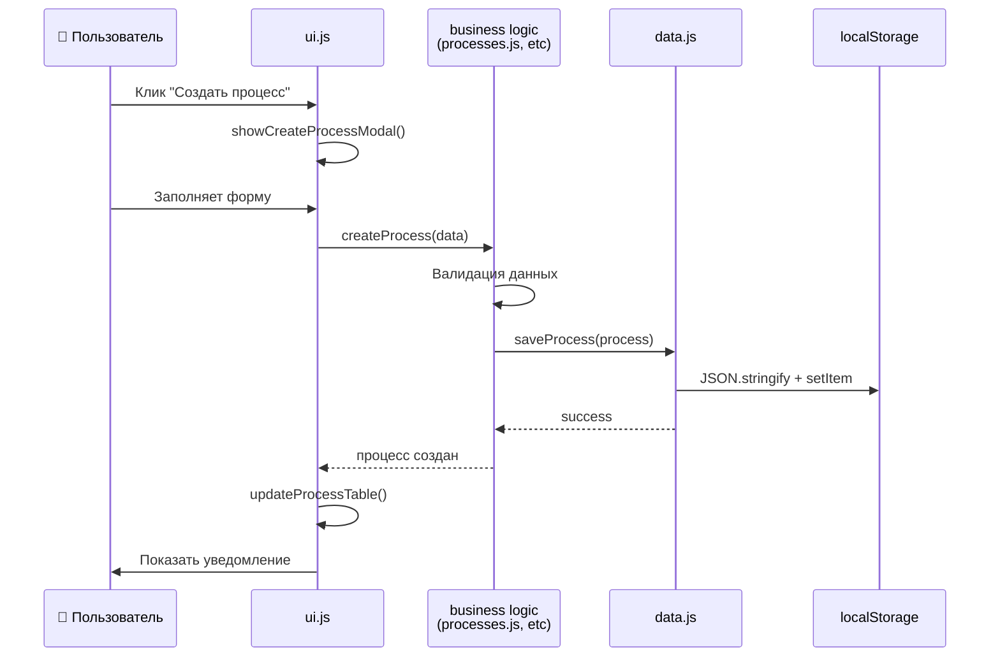

# 🏗️ OMS Simple - Упрощённая архитектура

> **Цель:** Простое, понятное, рабочее приложение без избыточной сложности

## 🎯 Принципы упрощения:

- ✅ **Минимум слоёв** - только необходимое
- ✅ **Понятный код** - читается как обычный JS
- ✅ **Быстрое исправление** - нашёл функцию → исправил
- ✅ **LocalStorage напрямую** - без лишних абстракций

---

## 📋 Диаграмма архитектуры

```mermaid
graph TD
    subgraph "🌐 Браузер"
        HTML[index.html]
        CSS[styles.css]
    end
    
    subgraph "📁 JavaScript Модули"
        MAIN[main.js<br/>- Инициализация<br/>- Роутинг<br/>- Глобальные функции]
        
        DATA[data.js<br/>- localStorage работа<br/>- Сохранение/загрузка<br/>- Демо-данные]
        
        USERS[users.js<br/>- Авторизация<br/>- Роли (Админ/Сотрудник)<br/>- Управление пользователями]
        
        PROCESSES[processes.js<br/>- CRUD процессов<br/>- Сортировка<br/>- Валидация]
        
        PRODUCTS[products.js<br/>- CRUD типов изделий<br/>- Настраиваемые поля<br/>- Связь с процессами]
        
        ORDERS[orders.js<br/>- CRUD заказов<br/>- Канбан-доска<br/>- Статусы]
        
        UI[ui.js<br/>- Рендеринг таблиц<br/>- Модальные окна<br/>- Уведомления]
    end
    
    subgraph "💾 Хранилище"
        LS[(localStorage<br/>users, processes,<br/>productTypes, orders)]
    end
    
    HTML --> MAIN
    MAIN --> USERS
    MAIN --> PROCESSES  
    MAIN --> PRODUCTS
    MAIN --> ORDERS
    MAIN --> UI
    
    USERS --> DATA
    PROCESSES --> DATA
    PRODUCTS --> DATA
    ORDERS --> DATA
    
    DATA --> LS
    
    UI --> USERS
    UI --> PROCESSES
    UI --> PRODUCTS
    UI --> ORDERS
    
    classDef core fill:#e1f5fe
    classDef business fill:#f3e5f5
    classDef storage fill:#e8f5e8
    
    class MAIN,DATA,UI core
    class USERS,PROCESSES,PRODUCTS,ORDERS business
    class LS storage
```

---

## 🗂️ Структура файлов

```
simple/
├── index.html              # Главная страница
├── styles.css              # Стили
├── ARCHITECTURE.md         # Этот файл - схема для будущих разработчиков
├── js/
│   ├── main.js            # Точка входа, роутинг
│   ├── data.js            # Работа с localStorage
│   ├── ui.js              # UI компоненты и рендеринг
│   ├── users.js           # Пользователи и авторизация
│   ├── processes.js       # Управление процессами
│   ├── products.js        # Типы изделий
│   └── orders.js          # Заказы и канбан
└── demo/
    └── demo-data.js       # Демо данные для тестирования
```

---

## 🔄 Поток данных



---

## 📊 Модель данных (простая)

```javascript
// localStorage ключи
const STORAGE_KEYS = {
    USERS: 'oms_users',
    PROCESSES: 'oms_processes', 
    PRODUCT_TYPES: 'oms_product_types',
    ORDERS: 'oms_orders',
    CURRENT_USER: 'oms_current_user'
};

// Структуры данных
const User = {
    id: number,
    name: string,
    role: 'admin' | 'employee',
    canCreateOrders: boolean,
    allowedProcesses: [processId, ...],
    createdAt: Date
};

const Process = {
    id: number,
    name: string,
    description: string,
    order: number,
    createdAt: Date
};

const ProductType = {
    id: number,
    name: string,
    description: string,
    processSequence: [processId, ...],
    customFields: [
        {
            id: number,
            name: string,
            type: 'text' | 'number' | 'select' | 'checkbox',
            required: boolean,
            options: [...] // для select
        }
    ],
    createdAt: Date
};

const Order = {
    id: number,
    number: string,
    customerName: string,
    customerPhone: string,
    productTypeId: number,
    currentProcessId: number,
    status: 'draft' | 'in_progress' | 'completed' | 'cancelled',
    customFieldValues: {
        [fieldId]: value
    },
    createdAt: Date
};
```

---

## 🎯 Ключевые функции по файлам

### **main.js** - Дирижёр
```javascript
// Инициализация приложения
init()
// Роутинг между разделами  
showSection(section)
// Авторизация
login(username)
// Глобальные утилиты
showSuccess(msg), showError(msg)
```

### **data.js** - Хранилище
```javascript
// Сохранение
save(key, data)
// Загрузка  
load(key, defaultValue)
// Генерация ID
generateId()
// Демо-данные
createDemoData()
```

### **ui.js** - Отображение
```javascript
// Рендеринг таблиц
renderTable(data, columns, actions)
// Модальные окна
showModal(title, content, buttons)
// Формы
renderForm(fields)
// Канбан доска
renderKanban(processes, orders)
```

### **processes.js** - Бизнес-логика процессов
```javascript
// CRUD
createProcess(data)
updateProcess(id, data)  
deleteProcess(id)
getAllProcesses()
// Сортировка
reorderProcesses(newOrder)
```

### **products.js** - Типы изделий
```javascript
// CRUD типов изделий
createProductType(data)
updateProductType(id, data)
deleteProductType(id)
// Настраиваемые поля
addCustomField(productTypeId, field)
updateCustomField(productTypeId, fieldId, data)
```

### **orders.js** - Заказы  
```javascript
// CRUD заказов
createOrder(data)
updateOrder(id, data)
deleteOrder(id)
// Перемещение по процессам
moveOrderToProcess(orderId, processId)
// Группировка для канбана
groupOrdersByProcess(orders)
```

### **users.js** - Пользователи
```javascript
// Авторизация
authenticateUser(name)
getCurrentUser()
// Управление пользователями
createUser(data)
updateUserPermissions(userId, permissions)
```

---

## ⚡ Преимущества простой архитектуры

### ✅ **Для разработчика:**
- Понятно с первого взгляда
- Легко найти нужную функцию
- Быстро исправить баг
- Добавить новый функционал за минуты

### ✅ **Для сопровождения:**
- Нет сложных зависимостей
- Каждый файл независим
- Простая отладка
- Минимум абстракций

### ✅ **Для производительности:**
- Быстрая загрузка (меньше кода)
- Прямая работа с данными
- Нет лишних слоёв
- Эффективная работа с DOM

---

## 🚀 План реализации

### **Этап 1: Основа (30 мин)**
1. Создать структуру файлов
2. Настроить data.js с localStorage
3. Базовый ui.js для модалок и таблиц
4. main.js с роутингом

### **Этап 2: Пользователи (15 мин)**
1. users.js - авторизация
2. Простая форма выбора пользователя
3. Проверка прав

### **Этап 3: Процессы (20 мин)**
1. processes.js - CRUD
2. Таблица процессов с кнопками
3. Модалки создания/редактирования

### **Этап 4: Заказы (25 мин)**
1. orders.js - базовый CRUD
2. Простая канбан доска
3. Формы заказов

### **Этап 5: Типы изделий (20 мин)**
1. products.js - CRUD
2. Настраиваемые поля
3. Связь с процессами

### **Итого: ~2 часа** вместо недель

---

## 💡 Для будущих разработчиков

### **Как начать работу:**
1. Откройте `index.html` в браузере
2. Изучите `ARCHITECTURE.md` (этот файл)
3. Начните с `main.js` - там вся инициализация
4. Найдите нужный файл по функционалу:
   - Пользователи → `users.js`
   - Процессы → `processes.js`
   - Заказы → `orders.js`
   - Типы изделий → `products.js`

### **Как добавить новый функционал:**
1. Определите к какому модулю относится
2. Добавьте функцию в соответствующий .js файл
3. При необходимости добавьте UI в `ui.js`
4. Обновите роутинг в `main.js`

### **Как исправить баг:**
1. Найдите в какой функции происходит ошибка
2. Откройте соответствующий файл
3. Исправьте - всё прямолинейно, без слоёв абстракции

---

## 🎯 Результат

**Получим рабочее приложение с тем же функционалом, но:**
- В 10 раз меньше кода
- В 100 раз проще для понимания  
- Без ошибок архитектуры
- С возможностью быстрого развития

**Архитектура останется понятной любому JS разработчику через месяц, год или при смене команды.**

---

*Диаграмма создана: 2025-01-28*  
*Принцип: "Максимум функций, минимум сложности"*